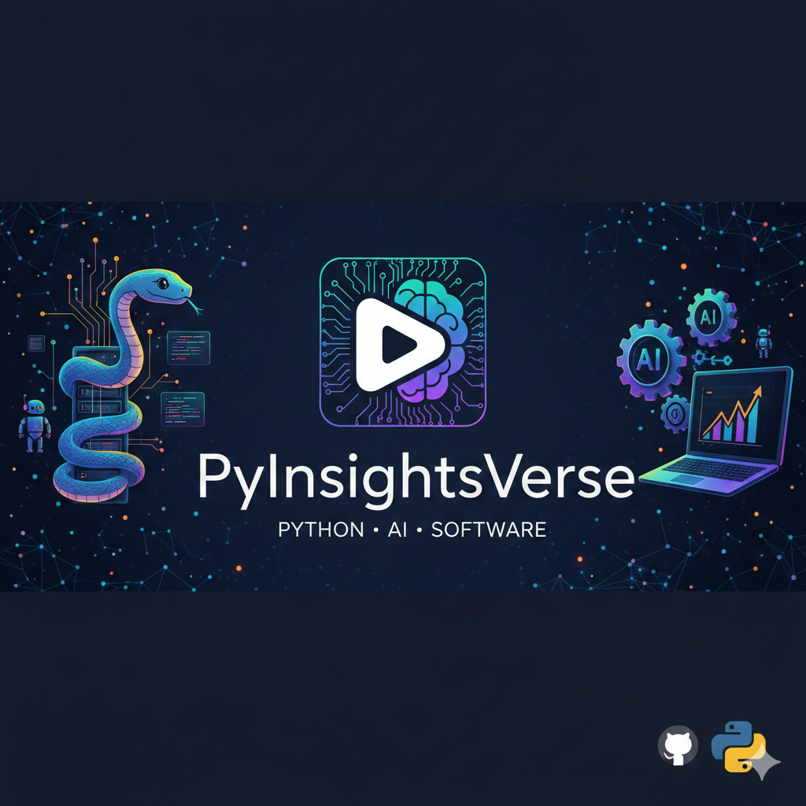

# PyInsightsVerse - Python, AI, & Software Engineering Tutorials



Welcome to the official GitHub repository for the PyInsightsVerse channel! This repository hosts all the code, projects, and resources demonstrated in my video tutorials on Python programming, Artificial Intelligence, and Software Engineering.

## 🚀 Getting Started

To get started with any of the projects in this repository, follow these general steps:

1.  **Clone the Repository:**
    ```bash
    git clone https://github.com/your-username/YouTube.git
    cd YouTube
    ```
2.  **Create a Virtual Environment (Recommended):**
    ```bash
    python -m venv venv
    ```
3.  **Activate the Virtual Environment:**
    *   **Windows:**
        ```bash
        .\venv\Scripts\activate
        ```
    *   **macOS/Linux:**
        ```bash
        source venv/bin/activate
        ```
4.  **Install Dependencies:**
    Navigate to the specific project directory (e.g., `Deep_learning/hand_digits/`) and install the required packages:
    ```bash
    pip install -r requirements.txt
    ```
    (Note: Not all subdirectories may have a `requirements.txt` file. If not present, install dependencies as needed per project instructions.)

## 📚 Project Categories

This repository is organized into the following main categories:

### Deep Learning
Code and notebooks related to various deep learning concepts and applications, including:
-   **Object Detection:** `Deep_learning/object_detection.py`
-   **YOLO:** `Deep_learning/yolo_starter.ipynb`

### Diffusion Models
Explorations and implementations of diffusion models for generative AI.
-   **Diffusion Models Notebook:** `Diffusion_models/diffusion-models.ipynb`

### Docker
Projects demonstrating Docker for containerization and application deployment.
-   **Basic Docker App:** `Docker/`

### Docker Compose
Examples of multi-container Docker applications using Docker Compose.
-   **Web App with Docker Compose:** `Docker-compose/webapp/`

### GeoSpatial
Tutorials and code for geospatial data processing and analysis.
-   **Geospatial Lessons:** `GeoSpatial/`

### InfluxDB
Projects showcasing integration with InfluxDB for time-series data.
-   **InfluxDB Integration:** `Influx/`

### MLflow
Examples of using MLflow for machine learning lifecycle management.
-   **MLflow Regression:** `MLflow_tutorial/regression.ipynb`

### Open Source Chat Models
Code related to working with and deploying open-source chat models.
-   **Python Chat Model:** `OpenSourceChatModels/python_chat_model.ipynb`

### PostgreSQL
Scripts and examples for working with PostgreSQL databases.
-   **PostgreSQL Setup & Data Generation:** `Postgres/`

### Reinforcement Learning
Introductions and implementations of reinforcement learning algorithms.
-   **Reinforcement Learning Notebook:** `Reinforcement_learning/re_learning.ipynb`

### Training Large Language Models (LLMs)
Resources and code for fine-tuning and deploying LLMs.
-   **LLM Fine-tuning:** `TrainLLM/`

## 📺 Connect with Us

Subscribe to my YouTube channel for more tutorials and content:
[Your YouTube Channel Link Here](https://www.youtube.com/channel/UCIijTJ4GfK1st6r5jyg3ENQ)

## ✨ Contributing

We welcome contributions! If you have suggestions or improvements, feel free to open an issue or submit a pull request.
